# BlackEdge Nxt
* Where did this come from, some history a PCB Tour? 
* What are the key elements, what is being solved?
* Where does this lead & when can we play with it?

## BlackEdge History
### 2016 BlackIce II
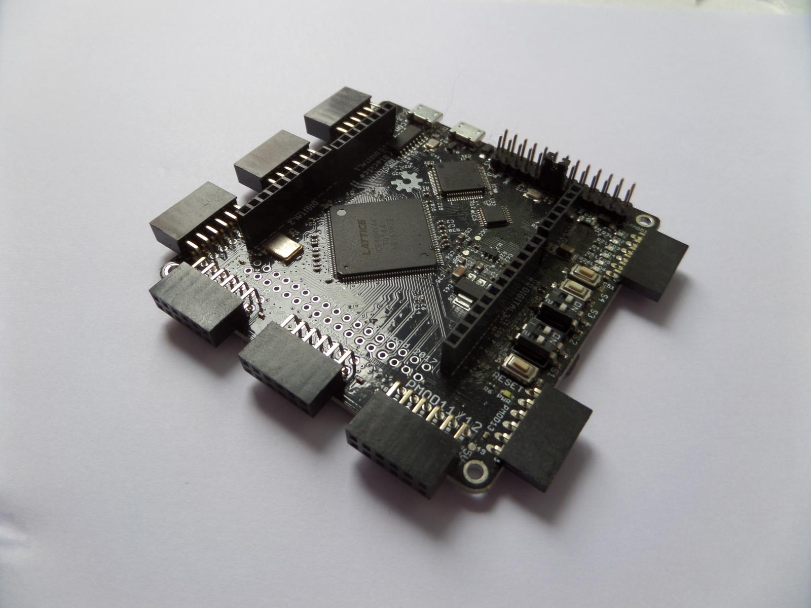
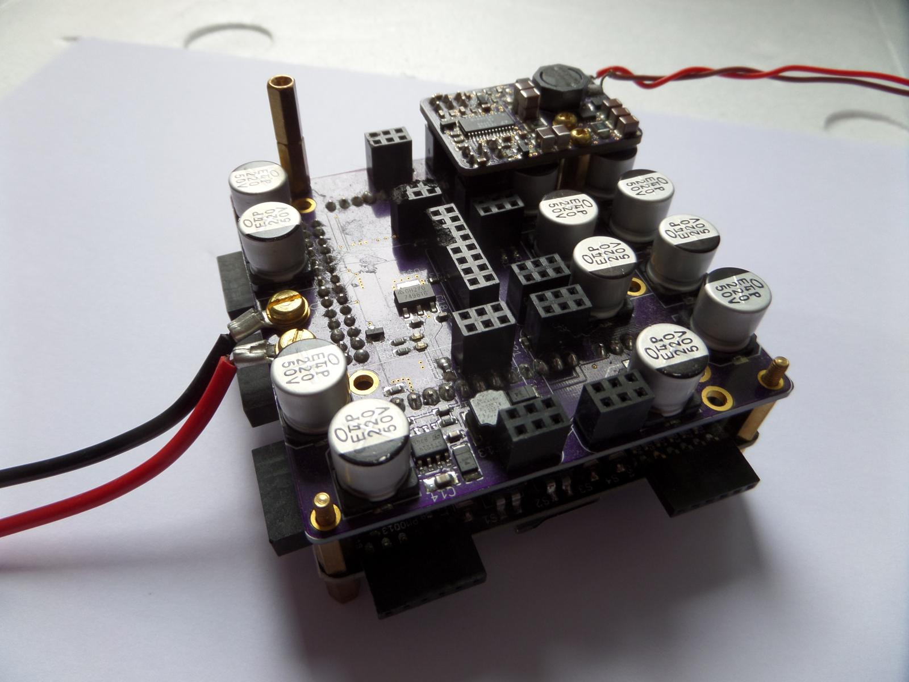
### 2018 BlackIce MX
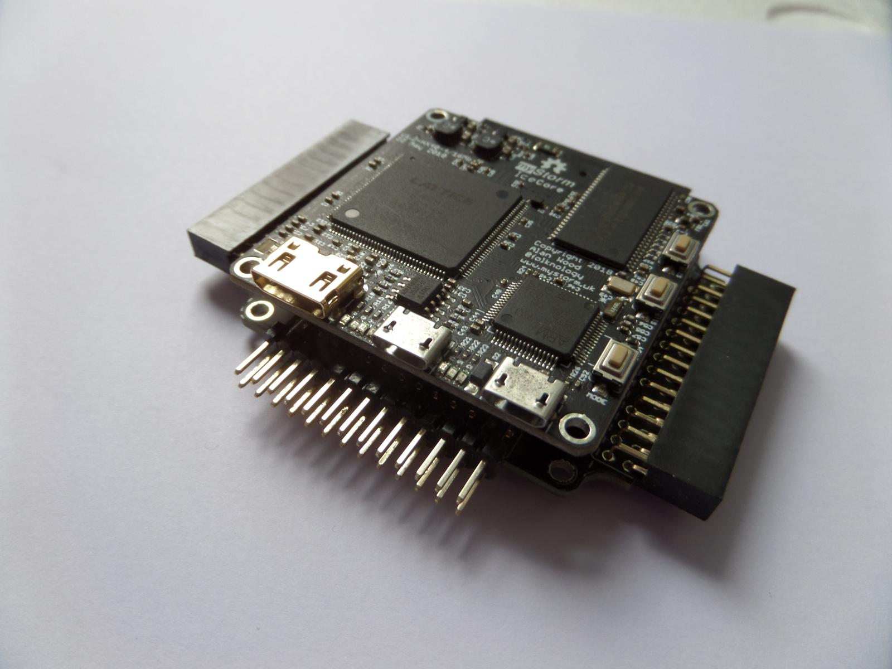
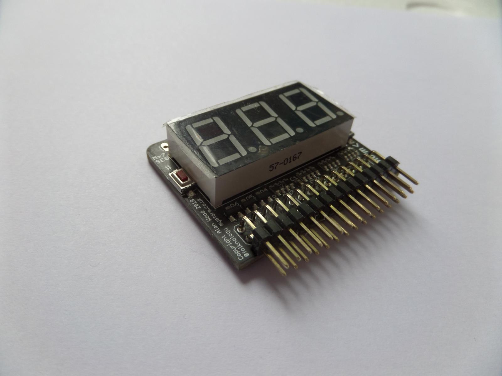
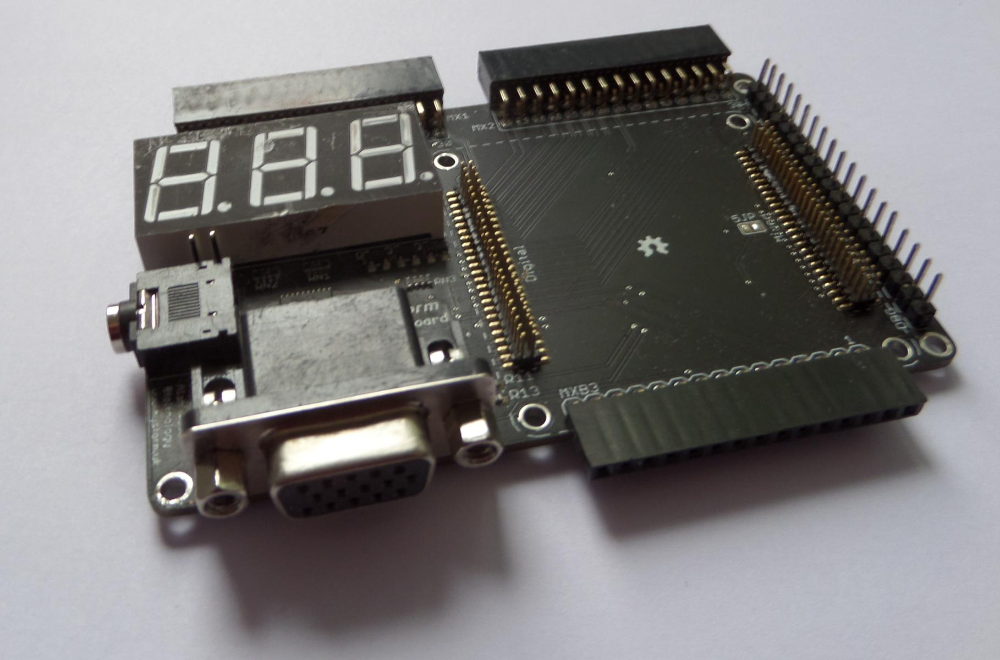
### 2019 Tiles & BlackEdge
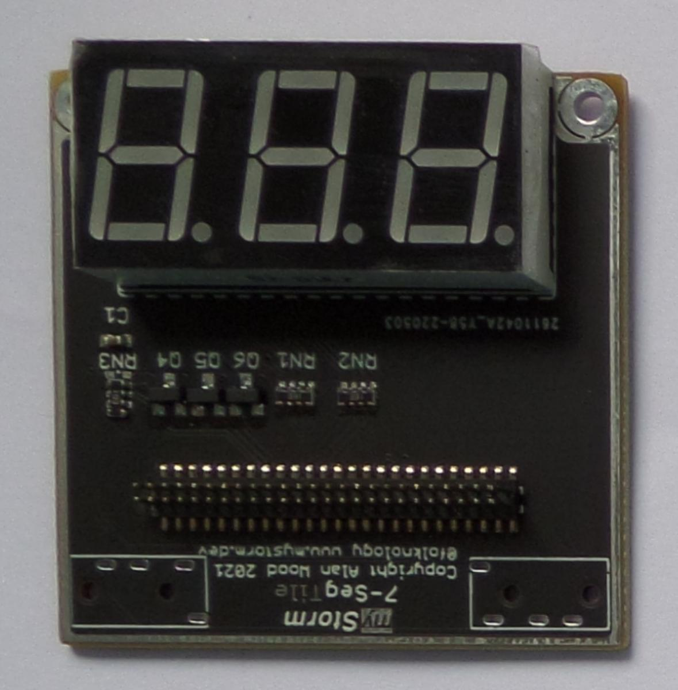
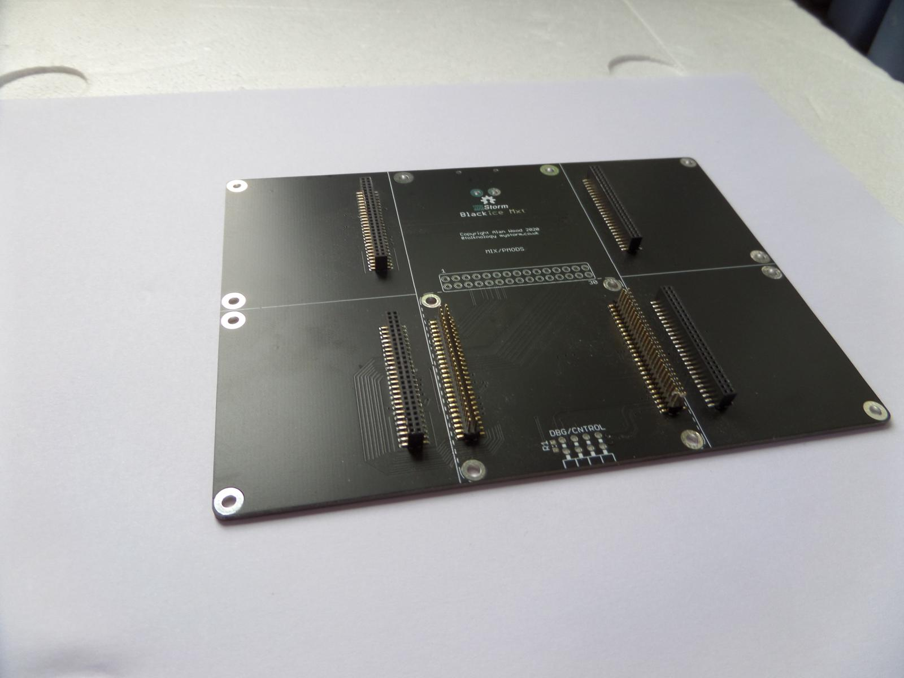
### 2020 Tiles, IceLogicDeck + Mezzanine
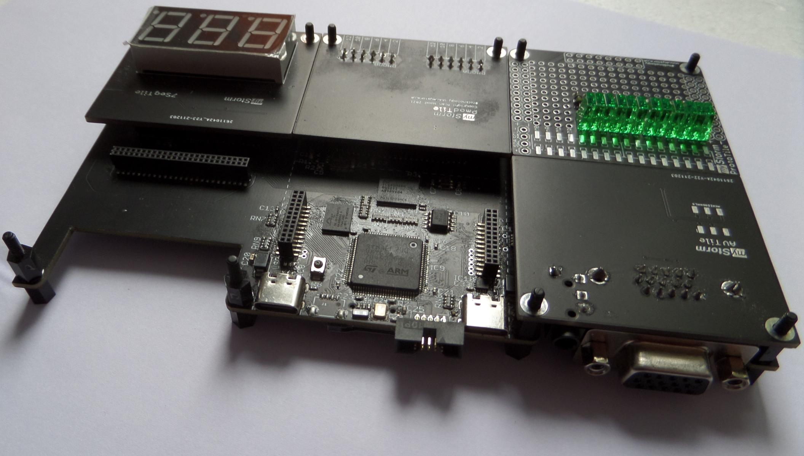
### 2021 Tiles, IceLogicDeck + BlackIce Nxt 
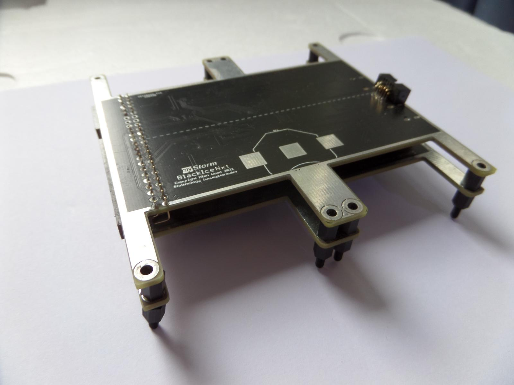
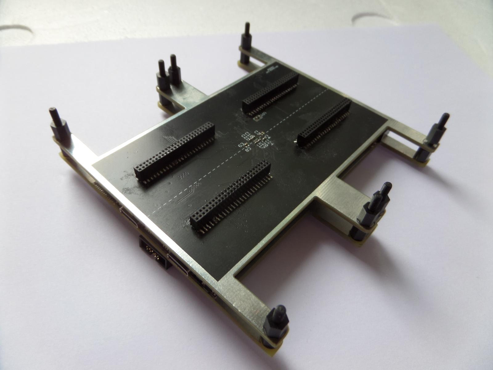
### 2022 Tiles, BlackEdge Nxt 
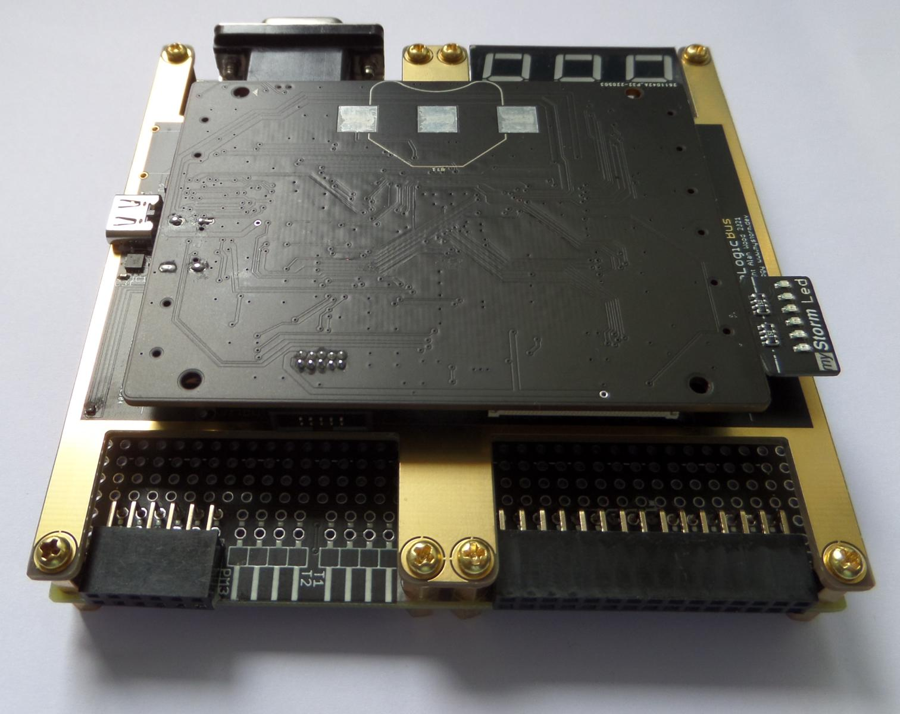
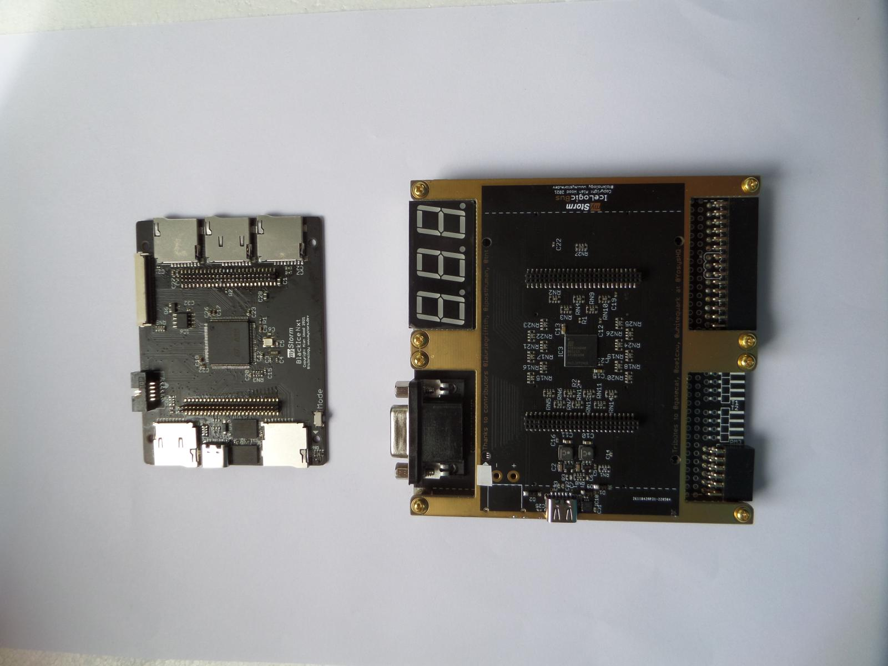
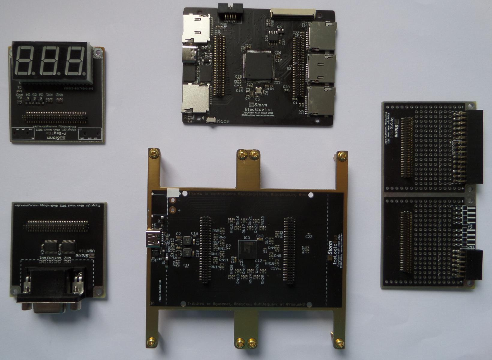

## BlackEdge NXT Key Features
* Mechanical stability & robust and reliable
* Stacked physical 3D integration with headroom for connectivity
* Connectivity 12 FPGA Digital, 2 Mixed signal, High Power and control.
* Interchangeable BlackEdge Nxt Controller
* Complete Compact modularity with Software/Tools

# [BlackEdge NXT https://github.com/folknology/BlackIceNxt/](https://github.com/folknology/BlackIceNxt/)

# [Discord https://discord.gg/SwexczKsqm](https://discord.gg/SwexczKsqm)