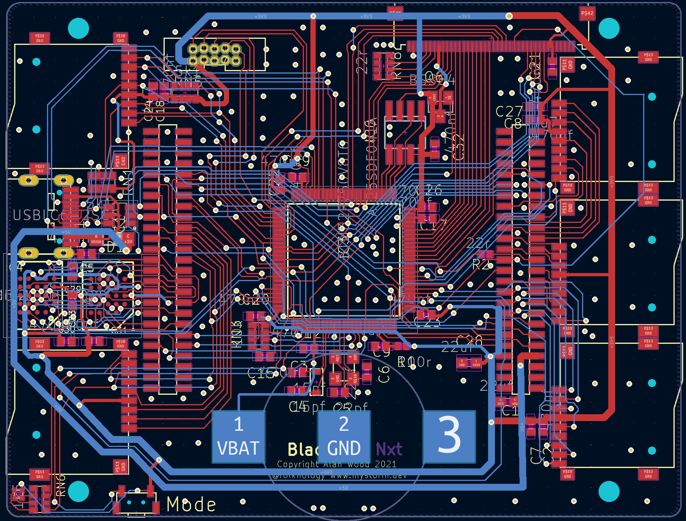
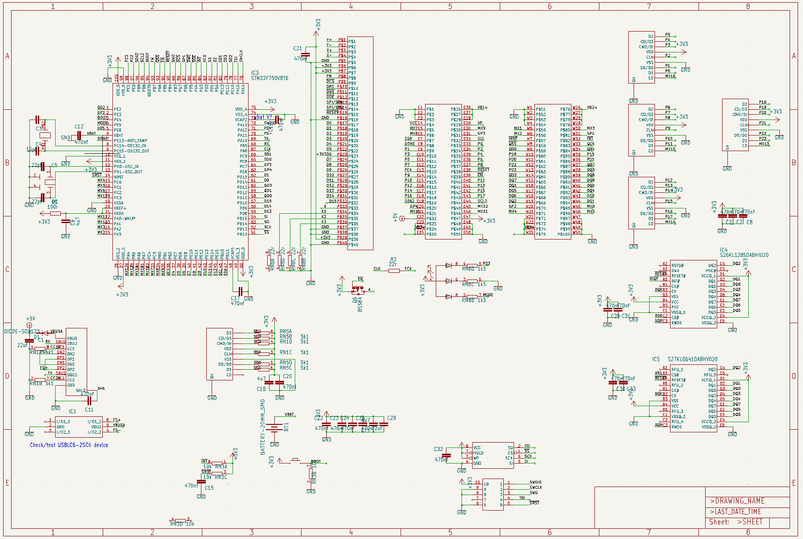

# BlackIceNxt
BlackIce Nxt is a new systems board for the myStorm FPGA development board family. I sports the following features:
* STM32F730 216Mhz Arm Cortex 7 Microcontroller with 256K RAM, 64k Flash
* 64Mbit HypeRam, 128Mbit HyperFlash for the MidPlane
* 16Mbit SPI Flash for local storage
* 25Mhz HSE and 32.768Khz LSE crystals
* 40 Pin FMC Parallel interface expansion
* QSPI interface to midPlanes
* 3 Micro Blades sockets
* SDCArd Socket
* SWD connector
* USB-C connector with serial over usb interface
* RGB Status LED and Mode button

### Black Ice PCB

###Top

###Bottom
